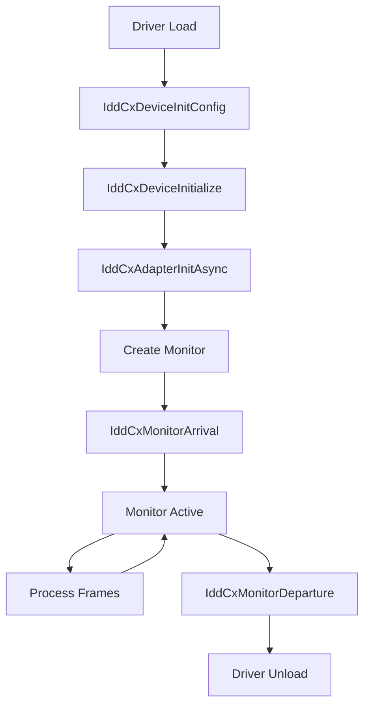

# Indirect Display Driver (IDD) Development Roadmap

This document provides a comprehensive roadmap for developing a Windows Indirect Display Driver (IDD) to create a true virtual GPU that will be recognized by Windows at the driver level.

## ⚠️ Prerequisites

Developing an IDD requires:
- **Windows 10/11** (64-bit)
- **Visual Studio 2022** with C++ Desktop Development
- **Windows Driver Kit (WDK)** matching your Windows SDK version
- **Windows SDK** (latest version)
- **Test Signing Enabled** (or EV certificate for production)

## 📚 Key Resources

| Resource | URL |
|----------|-----|
| IDD Model Overview | [Microsoft Learn](https://docs.microsoft.com/en-us/windows-hardware/drivers/display/indirect-display-driver-model-overview) |
| IDD Sample Code | [GitHub - Windows-driver-samples](https://github.com/microsoft/Windows-driver-samples/tree/main/video/IndirectDisplay) |
| IddCx Reference | [Microsoft Learn](https://docs.microsoft.com/en-us/windows-hardware/drivers/ddi/iddcx) |
| UMDF Development | [Microsoft Learn](https://docs.microsoft.com/en-us/windows-hardware/drivers/wdf/getting-started-with-umdf-version-2) |

---

## Phase 1: Environment Setup (Week 1-2)

### 1.1 Install Development Tools

```powershell
# Visual Studio 2022 with:
# - Desktop development with C++
# - Windows 10/11 SDK
# - Spectre-mitigated libraries

# Download WDK from:
# https://docs.microsoft.com/en-us/windows-hardware/drivers/download-the-wdk
```

### 1.2 Enable Test Signing

```powershell
# Run as Administrator
bcdedit /set testsigning on
# Restart required
```

### 1.3 Clone Sample Driver

```powershell
git clone https://github.com/microsoft/Windows-driver-samples.git
cd Windows-driver-samples/video/IndirectDisplay
```

### 1.4 Build Sample

1. Open `IddSample.sln` in Visual Studio
2. Set target to `x64` / `Debug`
3. Build the solution
4. Output: `IddSample.dll` + `IddSample.inf`

---

## Phase 2: Understanding IDD Architecture (Week 2-3)

### 2.1 Core Components

```
┌─────────────────────────────────────────────────────────┐
│                    Windows Desktop                      │
└─────────────────────────┬───────────────────────────────┘
                          │
┌─────────────────────────▼───────────────────────────────┐
│                    DWM (Desktop Window Manager)         │
└─────────────────────────┬───────────────────────────────┘
                          │
┌─────────────────────────▼───────────────────────────────┐
│                    IddCx (Indirect Display Class)       │
│                    - Provided by Microsoft              │
│                    - Handles DXGI/D3D integration       │
└─────────────────────────┬───────────────────────────────┘
                          │
┌─────────────────────────▼───────────────────────────────┐
│                    YOUR IDD DRIVER                       │
│                    (User-Mode UMDF Driver)               │
│                                                          │
│  ┌─────────────────────────────────────────────────────┐│
│  │ IndirectDeviceContext                               ││
│  │ - Adapter creation                                  ││
│  │ - Monitor arrival/departure                         ││
│  └─────────────────────────────────────────────────────┘│
│  ┌─────────────────────────────────────────────────────┐│
│  │ SwapChainProcessor                                  ││
│  │ - Desktop image processing                          ││
│  │ - Frame handling                                    ││
│  └─────────────────────────────────────────────────────┘│
└─────────────────────────────────────────────────────────┘
```

### 2.2 Key IddCx Functions

| Function | Purpose |
|----------|---------|
| `IddCxAdapterInitAsync` | Initialize the virtual adapter |
| `IddCxMonitorCreate` | Create a virtual monitor |
| `IddCxMonitorArrival` | Notify system of monitor connection |
| `IddCxMonitorDeparture` | Notify system of monitor disconnection |
| `IddCxSwapChainFinishedProcessingFrame` | Signal frame processing complete |

### 2.3 Driver Lifecycle



---

## Phase 3: Basic Implementation (Week 3-5)

### 3.1 Create Your Driver Project

1. Create new UMDF2 driver project in Visual Studio
2. Add IddCx headers and libraries
3. Implement core callbacks:

```cpp
// Driver entry
NTSTATUS DriverEntry(
    _In_ PDRIVER_OBJECT DriverObject,
    _In_ PUNICODE_STRING RegistryPath
) {
    WDF_DRIVER_CONFIG config;
    WDF_DRIVER_CONFIG_INIT(&config, DeviceAdd);
    return WdfDriverCreate(DriverObject, RegistryPath,
                          WDF_NO_OBJECT_ATTRIBUTES, &config, WDF_NO_HANDLE);
}
```

### 3.2 Implement Adapter Initialization

```cpp
NTSTATUS AdapterInitialize(IDDCX_ADAPTER* pAdapter) {
    IDDCX_ADAPTER_CAPS caps = {};
    caps.Size = sizeof(IDDCX_ADAPTER_CAPS);
    caps.MaxMonitorsSupported = 1;
    caps.EndPointDiagnostics.Size = sizeof(IDDCX_ENDPOINT_DIAGNOSTIC_INFO);
    caps.EndPointDiagnostics.GammaSupport = IDDCX_FEATURE_IMPLEMENTATION_NONE;

    IDARG_IN_ADAPTER_INIT initIn = {};
    initIn.WdfDevice = m_Device;
    initIn.pCaps = &caps;

    return IddCxAdapterInitAsync(&initIn, pAdapter);
}
```

### 3.3 Configure EDID (Display Identity)

The EDID is crucial - it defines the virtual monitor's identity:

```cpp
// 128-byte EDID for 1920x1080 @ 60Hz
static const BYTE s_EDID[] = {
    0x00, 0xFF, 0xFF, 0xFF, 0xFF, 0xFF, 0xFF, 0x00, // Header
    0x1E, 0x6D, // Manufacturer ID (e.g., "SGX")
    0x01, 0x00, // Product code
    // ... Full EDID structure for your virtual GPU
};
```

---

## Phase 4: Monitor and Resolution Support (Week 5-7)

### 4.1 Define Supported Modes

```cpp
static const struct {
    UINT Width;
    UINT Height;
    UINT VSync;
} s_SupportedModes[] = {
    { 1920, 1080, 60 },
    { 2560, 1440, 60 },
    { 3840, 2160, 30 },
};
```

### 4.2 Implement Monitor Creation

```cpp
NTSTATUS CreateMonitor() {
    // Create monitor with EDID
    IDDCX_MONITOR_INFO monitorInfo = {};
    monitorInfo.Size = sizeof(IDDCX_MONITOR_INFO);
    monitorInfo.MonitorType = DISPLAYCONFIG_OUTPUT_TECHNOLOGY_HDMI;
    monitorInfo.ConnectorIndex = 0;
    monitorInfo.MonitorDescription.Size = sizeof(IDDCX_MONITOR_DESCRIPTION);
    monitorInfo.MonitorDescription.Type = IDDCX_MONITOR_DESCRIPTION_TYPE_EDID;
    monitorInfo.MonitorDescription.DataSize = sizeof(s_EDID);
    monitorInfo.MonitorDescription.pData = s_EDID;

    IDARG_IN_MONITORCREATE createIn = {};
    createIn.ObjectAttributes = WDF_NO_OBJECT_ATTRIBUTES;
    createIn.pMonitorInfo = &monitorInfo;

    return IddCxMonitorCreate(m_Adapter, &createIn, &m_Monitor);
}
```

---

## Phase 5: Frame Processing (Week 7-9)

### 5.1 SwapChain Processor

```cpp
class SwapChainProcessor {
    HANDLE m_hThread;
    IDDCX_SWAPCHAIN m_SwapChain;

    void ProcessFrames() {
        while (!m_bTerminate) {
            IDARG_IN_SWAPCHAINACQUIREANDRELEASE args = {};
            HRESULT hr = IddCxSwapChainAcquireNextBuffer(m_SwapChain, INFINITE, &args);

            if (SUCCEEDED(hr)) {
                // Process the DirectX surface
                // args.MetaData contains frame info
                // args.DirtyRects contains changed regions

                IddCxSwapChainFinishedProcessingFrame(m_SwapChain);
            }
        }
    }
};
```

### 5.2 DirectX Integration

```cpp
// Create D3D11 device for frame processing
D3D_FEATURE_LEVEL featureLevels[] = { D3D_FEATURE_LEVEL_11_0 };
hr = D3D11CreateDevice(
    nullptr,
    D3D_DRIVER_TYPE_HARDWARE,
    nullptr,
    D3D11_CREATE_DEVICE_BGRA_SUPPORT,
    featureLevels,
    ARRAYSIZE(featureLevels),
    D3D11_SDK_VERSION,
    &m_Device,
    nullptr,
    &m_Context
);
```

---

## Phase 6: Driver Signing and Installation (Week 9-10)

### 6.1 Create INF File

```inf
[Version]
Signature   = "$Windows NT$"
Class       = Display
ClassGUID   = {4d36e968-e325-11ce-bfc1-08002be10318}
Provider    = %ManufacturerName%
CatalogFile = GPUSim.cat
DriverVer   = 01/01/2024,1.0.0.0

[Manufacturer]
%ManufacturerName% = Models,NTamd64

[Models.NTamd64]
%DeviceName% = GPUSim_Install, Root\GPUSim

[GPUSim_Install]
CopyFiles = GPUSim_CopyFiles

[GPUSim_CopyFiles]
GPUSim.dll

[GPUSim_Install.Services]
AddService = GPUSimService,0x00000002,GPUSim_Service

[GPUSim_Service]
ServiceType   = 1
StartType     = 3
ErrorControl  = 1
ServiceBinary = %12%\GPUSim.dll

[Strings]
ManufacturerName = "GPU-SIM Project"
DeviceName = "GPU-SIM Virtual Graphics Adapter"
```

### 6.2 Test Signing

```powershell
# Create test certificate
makecert -r -pe -ss PrivateCertStore -n "CN=GPU-SIM Test" GPUSim.cer

# Sign driver
signtool sign /v /s PrivateCertStore /n "GPU-SIM Test" /t http://timestamp.digicert.com GPUSim.dll
signtool sign /v /s PrivateCertStore /n "GPU-SIM Test" /t http://timestamp.digicert.com GPUSim.cat
```

### 6.3 Installation

```powershell
# Install driver
pnputil /add-driver GPUSim.inf /install

# Create device
devcon install GPUSim.inf Root\GPUSim
```

---

## Phase 7: Testing and Debugging (Week 10-12)

### 7.1 Debugging Setup

```powershell
# Enable WPP tracing
tracelog -start GPUSimTrace -guid GPUSim.guid -f GPUSim.etl -flags 0xFF -level 5

# View with TraceView or WPA
```

### 7.2 IddCx Debugging Registry Keys

```reg
[HKEY_LOCAL_MACHINE\SYSTEM\CurrentControlSet\Control\GraphicsDrivers]
"IddCxDebugCtrl"=dword:00000001
```

### 7.3 Verification Checklist

- [ ] Virtual monitor appears in Display Settings
- [ ] Task Manager shows GPU in Performance tab
- [ ] DxDiag lists the virtual adapter
- [ ] GPU-Z detects the device
- [ ] Applications can render to virtual display

---

## Phase 8: Production Readiness (Week 12+)

### 8.1 EV Code Signing Certificate

For production distribution, you need:
- Extended Validation (EV) code signing certificate (~$400-$500/year)
- Hardware Security Module (HSM) for key storage
- Windows Hardware Developer Center account

### 8.2 WHQL Certification (Optional)

- Submit driver to Microsoft for certification
- Provides Windows Update distribution
- Higher user trust

---

## 🎯 Milestones Summary

| Phase | Duration | Deliverable |
|-------|----------|-------------|
| 1. Environment Setup | 1-2 weeks | Build system ready |
| 2. Architecture Study | 1 week | Understanding of IddCx |
| 3. Basic Implementation | 2 weeks | Driver skeleton |
| 4. Monitor Support | 2 weeks | Virtual monitor appears |
| 5. Frame Processing | 2 weeks | Desktop capture works |
| 6. Signing/Installation | 1 week | Installable driver |
| 7. Testing | 2 weeks | Verified functionality |
| 8. Production | Ongoing | Signed, distributable |

---

## 💡 Alternative Approaches

If full IDD development is too complex, consider:

1. **Virtual Display Adapter (VDA)** - Simpler, uses existing drivers
2. **Parsec Virtual Display** - Open-source reference
3. **usbmmidd** - Virtual display via USB emulation
4. **iddcx-plus** - Community IDD extensions

---

## 📞 Support Resources

- [Windows Driver Development Forum](https://social.msdn.microsoft.com/Forums/windowsdesktop/en-US/home?category=windowsdriver)
- [OSR Online - Driver Development](https://community.osr.com/)
- [GitHub Issues on Sample](https://github.com/microsoft/Windows-driver-samples/issues)
